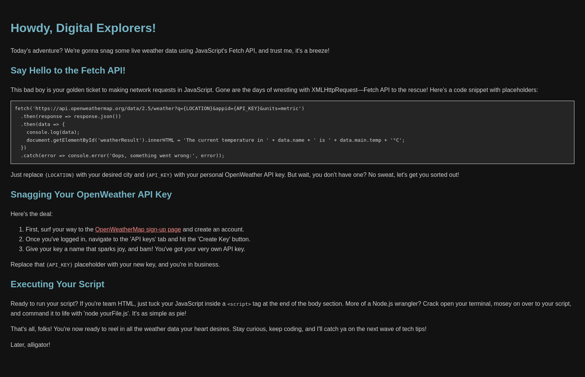

# API JavaScript Tutorial


🌐 **Live Demo:** [https://raimonvibe.github.io/api_javascript/](https://raimonvibe.github.io/api_javascript/)

## About
This repository contains the code and resources for the Fetch API tutorial by Raimonvibe.

## Getting Started

To use this project, clone the repo and open `index.html` in your browser to see the Fetch API in action.

```bash
git clone https://github.com/raimonvibe/api_javascript.git
```

## License
This project is licensed under the MIT License - see the LICENSE file for details.


